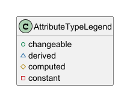

# Plant UML Diagrams from Faktor-IPS Model Classes

A bash script using XSL to create plantUml class diagrams from [Faktor-IPS](https://github.com/faktorips) model classes.

## Prerequisites
* You are using Linux, Mac, or WSL with xsltproc installed 
* OR you have docker installed
* You know where to find your Faktor-IPS model classes :)

## Using in Docker
* Build the Dockerfile:  `docker build . -t alpine-ips2plant`
* In Windows: use the batch script `ips2plantDocker.bat`
* **Please observe:** since the path to your IPS repository must be mounted as well as the scripts, the `ips2plantDocker.bat` script requires that you add the repository path as the first argument and use `/repos/` as prefix for your paths, e.g. `ips2plantDocker.bat C:\Users\me\whatever -p "/repos/im/domain/model ..."`

## Usage
See `./ips2plant-sh -h` or `.\ips2plantDocker.bat <repos_path> -h`

## Attribute Types
Attribute visibility markers are misused for Faktor-IPS attribute types:



## Example
Let's say you have Faktor-IPS model classes in `<path_to_repos>/im/domain/model` and `<path_to_repos>/ipm/business/model`.
The first thing you may do, is to execute `./ips2plant.sh -o output/my-test.puml -p "<path_to_repos>/im/domain/model <path_to_repos>/ipm/business/model"`. 
This will copy all the model files to the working directory, put them in an XML file, and execute the XSL transformation to create the plantUml. 

Once you have created the XML with all the classes, you can omit the path argument and try different options for the created class diagram. You can for instance use `-r -s -a -k` for adding role names on associations, external supertypes, external associations, and packaging. 

Adding `-et -ea -pr -t -tu` gives you enum types and associations, product types, table structures, and table usage. And `-pf <my_package>` limits the view to a certain package. Play around with it and have fun. :)

It might be helpful to have a wrapper script for diagrams you wish to build repeatedly, e.g.:
```
#!/usr/bin/env bash

IPS_2_PLANT="<path to>/ips2plant.sh"
RESULT="<wherever you want>"
WORKDIR="$RESULT/workdir"
OUTPUT="$RESULT/output"
VM_PATH="<path to>/vm"

BASIS="$VM_PATH/vm.basis/basis/domain/modell"
SHU_BASIS="$VM_PATH/vm.basis/shu/domain/modell"
SHU_ERW="$VM_PATH/vm.shu.privat/shu-erw/domain/modell"
HAUSRAT="$VM_PATH/vm.shu.privat/hausrat/domain/modell"

mkdir -p $OUTPUT

$IPS_2_PLANT -w $WORKDIR -dw -p "$BASIS" -o $OUTPUT/basis_plain.puml -l 3
$IPS_2_PLANT -w $WORKDIR -o $OUTPUT/basis_packages.puml -k -l 3
$IPS_2_PLANT -w $WORKDIR -o $OUTPUT/basis_complete.puml -k -r -s -pr -t -tu -et -l 3

$IPS_2_PLANT -w $WORKDIR -o $OUTPUT/basis_versicherung.puml -k -r -s -pr -t -tu -et -l 3 -pf versich -a -ea

$IPS_2_PLANT -w $WORKDIR -dw -p "$BASIS $SHU_BASIS $SHU_ERW $HAUSRAT" -o $OUTPUT/hausrat_plain.puml -l 3
$IPS_2_PLANT -w $WORKDIR -o $OUTPUT/hausrat_steuer.puml -k -r -s -pr -t -tu -et -l 3 -pf steuer -a -ea
$IPS_2_PLANT -w $WORKDIR -o $OUTPUT/hausrat_zuna.puml -k -r -s -pr -t -tu -et -l 3 -pf zuna -a -ea
...
```
