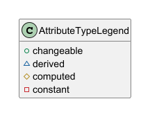

# IPS to PlantUML - IntelliJ Plugin

An IntelliJ IDEA plugin that generates [PlantUML](https://plantuml.com/) class diagrams from [Faktor-IPS](https://github.com/faktorips) model files, directly inside your IDE.

## Supported IPS File Types

| Extension                  | Description              |
|----------------------------|--------------------------|
| `.ipspolicycmpttype`       | Policy component types   |
| `.ipsproductcmpttype`      | Product component types  |
| `.ipsenumtype`             | Enum types               |
| `.ipstablestructure`       | Table structures         |

## Installation

1. Build the plugin: `./gradlew buildPlugin`
2. The plugin zip will be at `build/distributions/ips2plant-intellij-plugin-<version>.zip`
3. In IntelliJ: **Settings > Plugins > gear icon > Install Plugin from Disk...** and select the zip

### Prerequisites

* IntelliJ IDEA 2024.1 or later
* Java 21+

## Usage

There are two ways to generate a diagram:

### Right-Click Action

1. In the **Project** view, right-click on one or more directories containing IPS model files
2. Select **Generate PlantUML Diagram**
3. The generated `.puml` opens in the editor

The right-click action uses the diagram options configured in the tool window (see below).

### Tool Window

1. Open the **IPS to PlantUML** tool window (bottom panel)
2. The plugin auto-detects `.ipsproject` files in your project and shows the model directories as a checkbox tree
3. Select the model directories you want to include
4. Configure the diagram options as needed
5. Click **Generate PlantUML**
6. The generated `.puml` opens in the editor
7. The diagram is regenerated when options are changed

### Resolve Dependencies

The plugin can include IPS model files from Maven dependency JARs in the diagram. This is useful when your project depends on shared base models (e.g. `de.faktorzehn` artifacts) and you want to see the full class hierarchy.

1. Select one or more model directories in the tree (or leave all unchecked to use all detected directories)
2. Click **Resolve Dependencies**
3. The plugin runs `mvn dependency:build-classpath` on the corresponding `pom.xml`, scans the resolved JARs for IPS model files (`model/**/*.ips*`), and extracts them to a temporary directory
4. The extracted dependency models appear under a **dependencies** node in the tree
5. Check the dependency models you want to include and click **Generate PlantUML**

Only external `de.faktorzehn` group dependencies are resolved — JARs belonging to modules within the current project are automatically excluded. The plugin locates Maven via `MAVEN_HOME`, `M2_HOME`, `PATH`, or common installation directories.

### Search

The search panel lets you find specific IPS classes by name and generate a diagram for just those classes.

1. Enter a class name pattern in the **Search** field (supports `*` wildcard, e.g. `*Contract*`, `Policy*`, `*Type`)
2. Press **Enter** or click **Search**
3. Matching classes appear as a checkbox list — all are selected by default
4. A PlantUML diagram is generated automatically for the checked results
5. Uncheck classes to exclude them and the diagram regenerates accordingly
6. Clear the search field to dismiss the search results and return to directory-based generation

The search is case-insensitive and matches against the simple class name (not the fully qualified name).

**Include Dependencies**: Check this option to also search in dependency JARs. If dependencies have not been resolved yet, the plugin will resolve them automatically before searching.

### Diagram Options

| Option                  | Description                                                                     |
|-------------------------|---------------------------------------------------------------------------------|
| Packages                | Groups classes into their packages                                              |
| Print target role       | Shows the `targetRolePlural` on composition arrows                              |
| External supertypes     | Adds inheritance of super types in dependencies or not in the selected packages |
| External associations   | Adds associations to classes not in the selected packages                       |
| Show tables             | Includes table structures in the diagram                                        |
| Show table usage        | Shows table usage by product component types                                    |
| Show enum types         | Includes enum types in the diagram                                              |
| Show enum associations  | Shows enum associations (including external enums)                              |
| Show product components | Includes product component types in the diagram                                 |
| Package filter          | Limits the diagram to a specific package and its associations                   |
| Connector length        | Length of association connectors (default: 2)                                   |

## Attribute Types

Attribute visibility markers represent Faktor-IPS attribute types:

| Marker | Attribute Type |
|--------|----------------|
| `+`    | changeable     |
| `~`    | derived        |
| `#`    | computed       |
| `-`    | constant       |

As shown in generated plantUml:



## Tips

* If you have the [PlantUML Integration](https://plugins.jetbrains.com/plugin/7017-plantuml-integration) plugin installed, the generated diagram will render automatically when opened.
* You can select multiple directories at once, e.g. a base model and a product-specific model, to get a combined diagram.

## Building from Source

```bash
cd intellij-plugin
./gradlew buildPlugin
```

To run a development instance of IntelliJ with the plugin loaded:

```bash
./gradlew runIde
```